# BookADoc

A comprehensive healthcare booking platform that connects patients with doctors through an intuitive appointment scheduling system, real-time communication, and seamless payment processing.

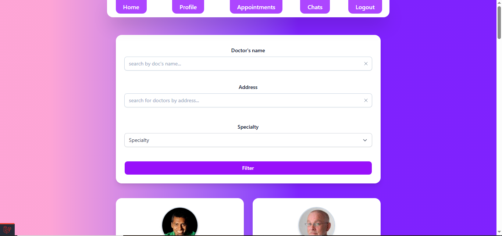

## Overview

BookADoc streamlines the process of finding and booking medical appointments. Patients can browse doctors by specialty, schedule appointments online, communicate directly with healthcare providers, and complete payments securely. Doctors manage their schedules, review appointments, and interact with patients through a dedicated portal.

The platform handles the entire appointment lifecycle—from discovery and booking to payment confirmation and follow-up communication—making healthcare more accessible and efficient for everyone involved.

### Demo
[](https://youtu.be/6QRotciGyS0)


## Key Features

### For Patients
- **Smart Doctor Discovery** - Browse and filter doctors by specialty, location, and availability
- **Instant Booking** - Schedule appointments with real-time availability updates
- **Secure Payments** - Complete transactions via Stripe with multiple payment methods
- **Direct Communication** - Real-time chat with doctors for consultations and follow-ups
- **Appointment Management** - View, track, and manage all appointments in one place

### For Doctors
- **Professional Profiles** - Showcase credentials, specialties, and availability
- **Schedule Control** - Set working hours and manage appointment slots
- **Patient Dashboard** - Access complete appointment history and patient communications
- **Cash Payment Options** - Confirm in-person payments directly through the platform
- **Real-time Notifications** - Stay updated on new bookings and patient messages

### For Administrators
- **Comprehensive Dashboard** - Monitor platform metrics, appointments, and payments
- **Doctor Verification** - Review and activate doctor registrations with credential validation
- **Analytics & Insights** - Track trends with visual charts and statistics
- **User Management** - Oversee both patient and doctor accounts
- **Payment Oversight** - Monitor transactions and financial activities

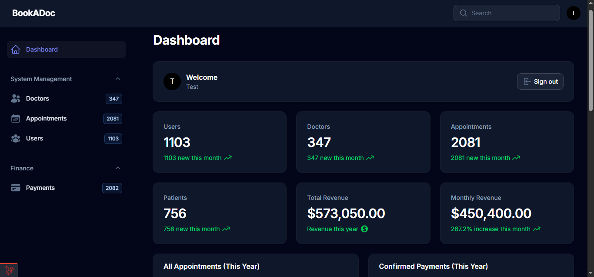

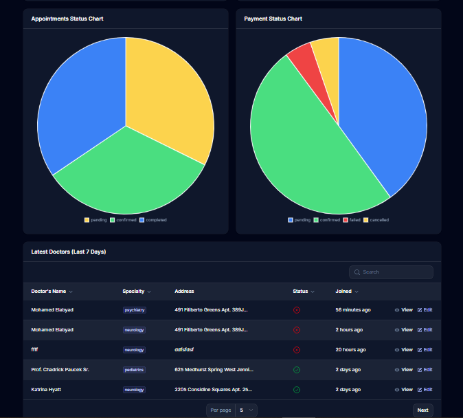
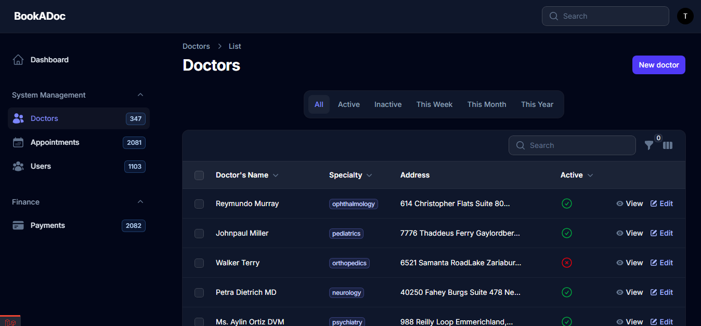
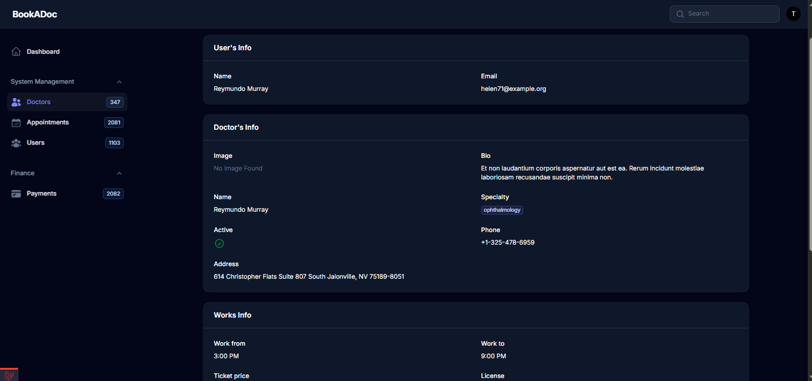

## Screenshots

### Patient Experience
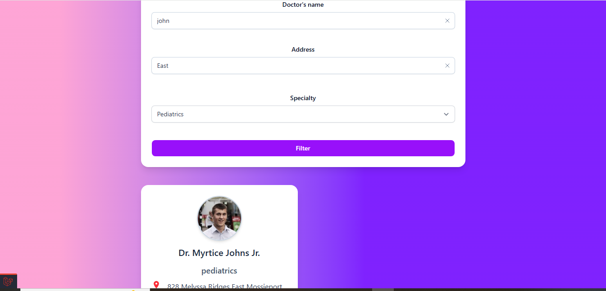
*Browse doctors by specialty and location*

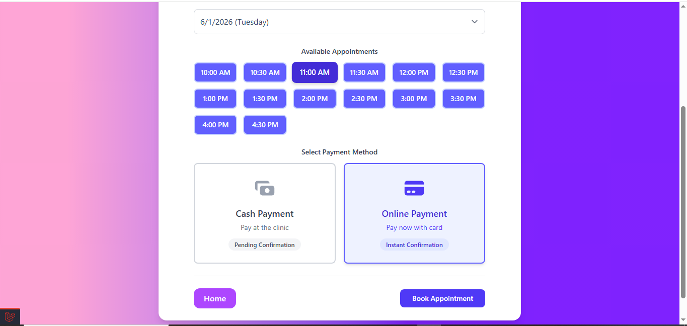
*Simple appointment scheduling interface*

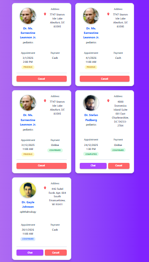
*patiant appointments interface*


*Secure Stripe payment integration*

### Doctor Portal
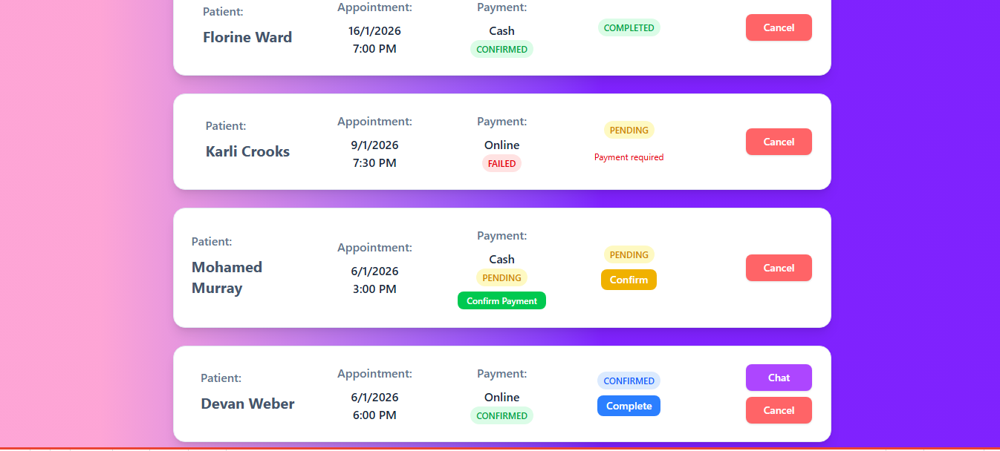
*Manage appointments and patient requests*


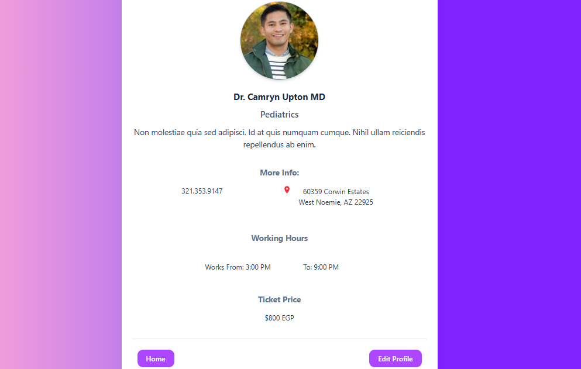
*Professional profile management*

### Real-time Features
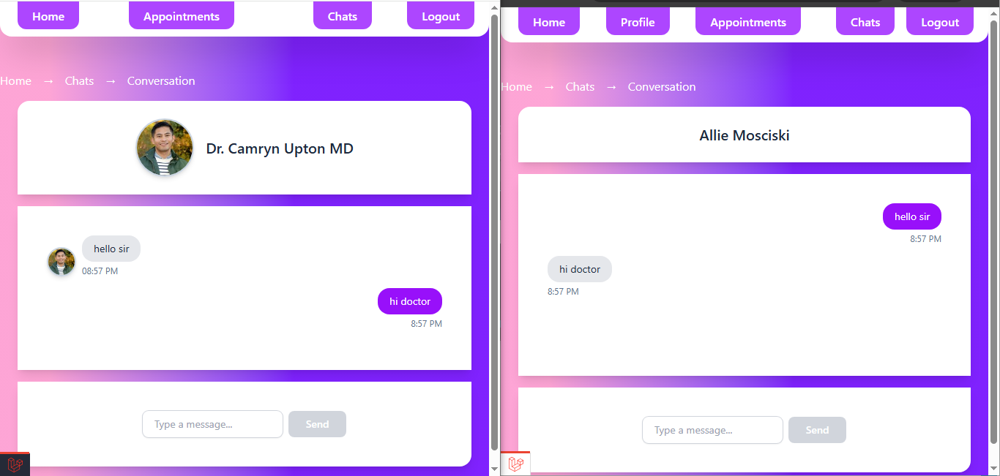
*Live messaging between doctors and patients*

---

## Technical Documentation

### Technology Stack

**Backend Framework**
- Laravel 12 (PHP 8.2+)
- MySQL Database
- Queue System for background jobs

**Frontend**
- Tailwind CSS 4
- Alpine.js for reactive components
- Vite for asset bundling

**Admin Panel**
- Filament 4 - Modern admin dashboard with comprehensive CRUD operations

**Real-time Communication**
- Pusher for WebSocket connections
- Laravel Echo for event broadcasting
- Private channels for secure messaging

**Payment Processing**
- Stripe integration with webhook support
- Multi-currency handling (EGP to USD conversion)
- Secure payment intent management

**Development Tools**
- Laravel Pint for code styling
- Pest PHP for testing
- Laravel Debugbar for debugging
- IDE Helper for enhanced autocomplete

### Architecture Highlights

**Dual-Role Authentication System**
```
User Model (Base)
├── Regular User Role (Patients)
└── Doctor Role
    └── Doctor Model (Extended Profile)
```
Users can register as patients or doctors with separate authentication flows. The `becomeDoctor()` method elegantly handles role transformation while maintaining data integrity.

**Eloquent Relationships**
The database schema leverages Laravel's powerful ORM with well-defined relationships:
- Users ↔ Doctors (One-to-One)
- Doctors ↔ Appointments (One-to-Many)
- Users ↔ Appointments (One-to-Many)
- Appointments ↔ Payments (One-to-One)
- Users ↔ Conversations ↔ Doctors (Chat system)
- Conversations ↔ Messages (One-to-Many)

**Enum-Driven Design**
Type-safe enumerations for critical data:
- `SpecialtyEnum` - 8 medical specialties (Cardiology, Dermatology, Neurology, Pediatrics, Orthopedics, Psychiatry, Dentistry, Ophthalmology)
- `StatusEnum` - Appointment states (Pending, Confirmed, Cancelled, Completed)
- `PaymentStatusEnum` - Payment tracking (Pending, Confirmed, Failed)
- `PaymentMethodEnum` - Payment types (Cash, Card)
- `RoleEnum` - User roles (User, Doctor, Admin)

**Observer Pattern Implementation**
Model observers handle complex business logic:
- `AppointmentObserver` - Triggers notifications on status changes
- `DoctorObserver` - Manages doctor activation workflow
- `PaymentObserver` - Coordinates payment confirmations with appointments
- `UserObserver` - Handles user registration events

**Service Layer Architecture**
- `StripeService` - Encapsulates all payment processing logic including checkout session creation, webhook handling, and payment confirmation
- `ChatService` - Manages conversation creation and message broadcasting

**Notification System**
10 custom notification classes covering the entire user journey:
- User notifications: Payment status, appointment confirmations
- Doctor notifications: New appointments, account activation status
- Automated reminders for upcoming appointments

### Database Schema

**Core Tables**
- `users` - Unified authentication for patients and doctors
- `doctors` - Extended profiles with specialties, licenses, working hours
- `appointments` - Booking records with date/time and status tracking
- `payments` - Financial transactions with Stripe metadata
- `conversations` - Chat threads between doctors and users
- `messages` - Individual chat messages with read status

**Indexes & Optimization**
- Foreign key constraints for referential integrity
- Timestamps for audit trails
- Soft deletes available where appropriate

### API Routes & Endpoints

**Public Routes**
- `GET /doctors` - Browse doctor listings with filters
- `GET /doctors/{doctor}` - View doctor profile details

**Patient Routes** (Auth Required)
- `POST /doctors/{doctor}/appointments` - Book appointment
- `GET /user/appointments` - View user's appointments
- `DELETE /user/appointments/{appointment}` - Cancel appointment

**Doctor Routes** (Auth + Doctor Role Required)
- `GET /doctor/appointments` - View doctor's appointments
- `PATCH /doctor/appointments/{appointment}` - Update appointment status
- `PATCH /doctor/appointments/{appointment}/confirm-cash-payment` - Mark cash payment as received
- `GET /profile`, `PATCH /profile` - Manage doctor profile

**Chat Routes** (Auth Required)
- `GET /chat` - List conversations
- `POST /chat` - Create new conversation
- `GET /chat/{conversation}` - View conversation messages
- `POST /chat/{conversation}/messages` - Send message
- `PATCH /chat/{conversation}/read` - Mark conversation as read

**Payment Routes**
- `POST /appointments/{appointment}/checkout` - Create Stripe session
- `POST /stripe/webhook` - Handle Stripe webhooks (unprotected CSRF)

### Filament Admin Panel

The admin dashboard provides comprehensive platform management:

**Resources**
- User Management - Full CRUD with role assignment
- Doctor Management - Profile review, credential verification, activation controls
- Appointment Management - Status tracking, filtering by date/doctor/patient
- Payment Management - Transaction monitoring, status updates

**Widgets**
- `StatsOverview` - Key metrics (total users, appointments, revenue)
- `AppointmentsChart` - Visual trends over time
- `AppointmentsStatusChart` - Status distribution (Pie/Donut chart)
- `PaymentsChart` - Revenue tracking
- `PaymentStatusChart` - Payment success rates
- `LatestDoctors` - Recent doctor registrations

### Real-time Features

**Broadcasting Setup**
Using Pusher with private channels for secure communication:
```php
MessageSent Event → broadcasts on Private Channel → updates recipient UI in real-time
```

**Echo Configuration**
Frontend listens to private channels with automatic reconnection and presence detection.

### Payment Flow

1. Patient creates appointment → Payment record created (Pending)
2. User clicks "Pay Now" → `StripeService::createCheckoutSession()`
3. Stripe Checkout page → User completes payment
4. Stripe webhook fires → `WebhookController::handle()`
5. `StripeService::confirmPayment()` → Updates payment status & appointment status
6. Notifications sent to both patient and doctor

**Currency Handling**
The system accepts payments in EGP but processes through Stripe in USD using a configurable exchange rate.

### Security Features

- CSRF protection on all state-changing routes (except webhooks)
- Role-based middleware (`auth`, `user`, `doctor`)
- Authorization gates for sensitive operations (e.g., `checkout` gate)
- Password hashing with bcrypt
- Database session storage
- Secure Stripe webhook signature verification

### Setup & Installation

1. **Clone Repository**
```bash
git clone <repository-url>
cd BookADoc
```

2. **Install Dependencies**
```bash
composer install
npm install
```

3. **Environment Configuration**
```bash
cp .env.example .env
php artisan key:generate
```

4. **Configure Database**
Update `.env` with your database credentials:
```env
DB_CONNECTION=mysql
DB_DATABASE=bookadoc
DB_USERNAME=root
DB_PASSWORD=
```

5. **Configure Stripe**
Add your Stripe keys to `.env`:
```env
STRIPE_KEY=your_publishable_key
STRIPE_SECRET=your_secret_key
STRIPE_WEBHOOK_SECRET=your_webhook_secret
```

6. **Configure Pusher**
Add your Pusher credentials to `.env`:
```env
BROADCAST_CONNECTION=pusher
PUSHER_APP_ID=your_app_id
PUSHER_APP_KEY=your_app_key
PUSHER_APP_SECRET=your_app_secret
PUSHER_APP_CLUSTER=your_cluster
```

7. **Run Migrations**
```bash
php artisan migrate
```

8. **Seed Data (Optional)**
```bash
php artisan db:seed
```

9. **Storage Link**
```bash
php artisan storage:link
```

10. **Start Development Servers**
```bash
composer dev
```
This runs the web server, queue worker, and Vite dev server concurrently.

Alternatively, run them separately:
```bash
php artisan serve
php artisan queue:listen
npm run dev
```

### Testing

```bash
composer test
# or
php artisan test
```

### Project Structure

```
app/
├── Console/          # Artisan commands
├── Enums/            # Type-safe enumerations
├── Events/           # Broadcasting events (MessageSent)
├── Filament/         # Admin panel resources & widgets
├── Http/
│   ├── Controllers/  # Route handlers (Auth, Chat, Doctor, Stripe, User)
│   └── Middleware/   # Custom middleware
├── Models/           # Eloquent models (User, Doctor, Appointment, etc.)
├── Notifications/    # Email/database notifications
├── Observers/        # Model event observers
├── Policies/         # Authorization policies
├── Services/         # Business logic (StripeService, ChatService)
└── Traits/           # Reusable traits

database/
├── factories/        # Model factories for testing
├── migrations/       # Database schema
└── seeders/          # Sample data seeders

resources/
├── css/              # Tailwind CSS
├── js/               # Alpine.js & Echo setup
└── views/            # Blade templates
    ├── auth/         # Login/registration views
    ├── chat/         # Chat interface
    ├── doctors/      # Doctor listing & profiles
    ├── users/        # User appointments
    └── components/   # Reusable Blade components

routes/
├── web.php           # Application routes
├── channels.php      # Broadcasting channels
└── console.php       # CLI commands
```


### License

This project is open-source software licensed under the MIT license.

---

**Built with Laravel, Filament, and modern web technologies to deliver a seamless healthcare booking experience.**

### Author

Developed by **Mohamed Elabyad**

📧 [m.elabyad.work@gmail.com](mailto:m.elabyad.work@gmail.com)

Feel free to reach out for questions, feedback, or collaboration opportunities!
